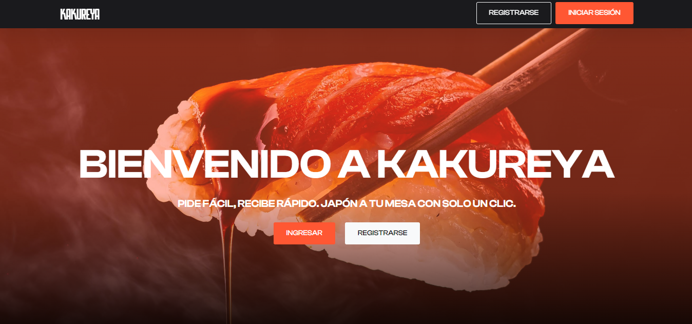
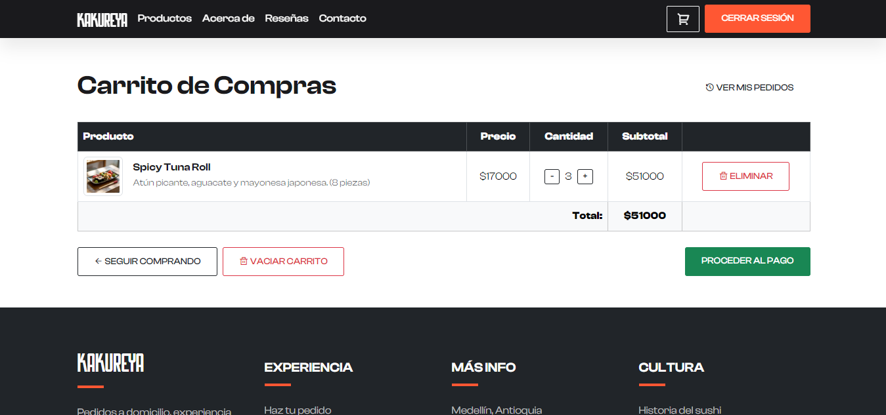
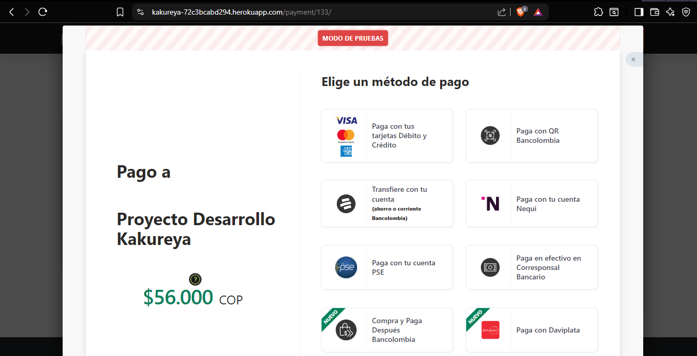
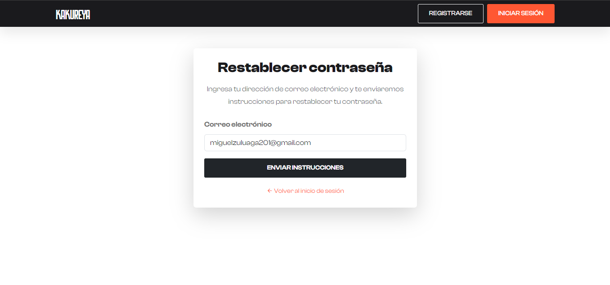

# Kakureya

**Kakureya** es una aplicación web desarrollada con Django que permite gestionar pedidos y despachos de comida japonesa a domicilio. Está orientada a mejorar la experiencia del cliente y optimizar la operación de restaurantes digitales, incluyendo dark kitchens, mediante un sistema eficiente.

<div align="center">



<br><br>



<br><br>



<br><br>



<br><br>

<h3>🏆 Reconocimiento Mejor proyecto PPI T&T, categoría tercer semestre, año 2025-1</h3>


</div>

---

## Funcionalidades principales

| Módulo/Componente          | Funcionalidad                                                                |
|----------------------------|------------------------------------------------------------------------------|
| `usuarios/`                | Registro, inicio de sesión, recuperación de contraseña, autenticación con sesiones |
| `productos/`               | Administración de productos: creación, edición, eliminación |
| `menu/`                    | Visualización dinámica del menú clasificado por categorías                  |
| `pedidos/`                  | Carrito de compras, confirmación de pedidos, historial por usuario, estados de pedido |
| `pasarela/`                | Integración con la API de Wompi para pagos en línea                         |
| `templates/` y `static/`   | Interfaz responsiva con archivos HTML, CSS, JS organizados                  |
| `settings.py`              | Configuración separada para entorno local y producción                     |
| `.env` (no incluido)       | Variables sensibles: conexión a PostgreSQL, claves AWS, email, Wompi       |

---

## Tecnologías utilizadas

- Lenguaje backend: Python 3.10+
- Framework web: Django 4.x
- Base de datos: PostgreSQL (entorno de producción), SQLite (modo local de pruebas)
- Frontend: HTML5, CSS3, Bootstrap 5, JavaScript
- Control de sesiones: Django Auth con recuperación de contraseña por correo
- Almacenamiento de archivos: AWS S3 para medios estáticos
- Pasarela de pagos: Wompi (API pública y privada)
- Control de versiones: Git

---

## Instalación y ejecución local

Este proyecto cuenta con un script de instalación automatizada (`setup.bat`) para entornos Windows.

### 1. Clonar el repositorio

```bash
git clone https://github.com/miguelczz/Kakureya.git
cd Kakureya
